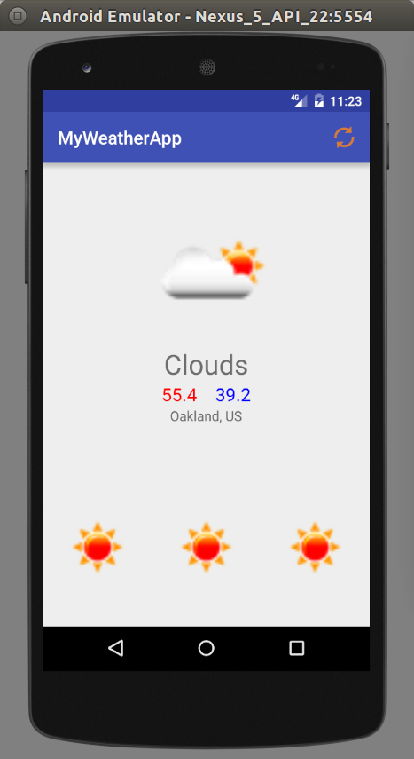

# MyWeatherApp

[MyWeatherApp](https://github.com/mike591/MyWeatherApp) is a small app that displays the weather. It uses the open weather api.

## Features & Implementation

### Displays weather

Displays current weather with highs and lows. Also displays the weather for the next 3 days.
